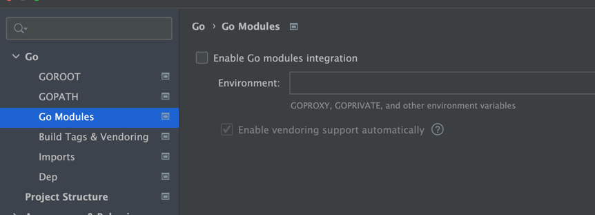

# 项目说明
这个项目中的代码全部是学习golang 相关后端知识所用的基本代码。   
都是由多个小的可以运行单元测试的模块组成 可以运行的入口函数都是以 xxx_run 格式定义的。    
只要把每个xxx_run函数拷贝到main.go 的main func中运行即可。

# golang实践学习笔记
通过看书+实践的方式来学习golang后端的相关的知识。

# 常用命令
## 设置环境
- 设置gopath `export GOPATH="/Users/bytedance/Desktop/my_proj/golang_review"`
- 安装自己的包的时候需要设置 `export GO111MODULE=off` 关闭111模块模式 [关于go1111module 模式的问题](https://learnku.com/go/t/39086#449e69) 
- 简单来说就是go111module允许go get 选择仓库的特定分支来编译

## 常用命令 
- 只编译 `go build -o main_run main.go`  生成main_run 的可执行文件
- 编译&运行 `go run xx.go`
- 从远端安装 go get xxx
- 安装自己写的包 `go install draw` 需要确保 draw 文件夹位于go path的src下面

## 注意事项
- 在不使用 modules 时，需要把goland中的modules选项关掉

# 内容说明
这里的代码主要是学习go语言使用 都是一些基本的小样例练手用的
更详细的积累    
读书笔记 [G55的golang 读书学习笔记](https://note.youdao.com/s/YrvSqmG2)